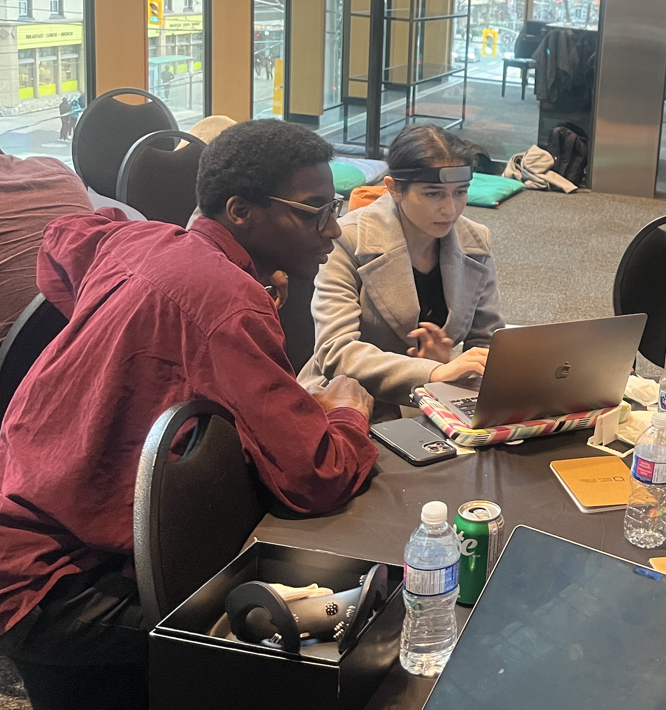
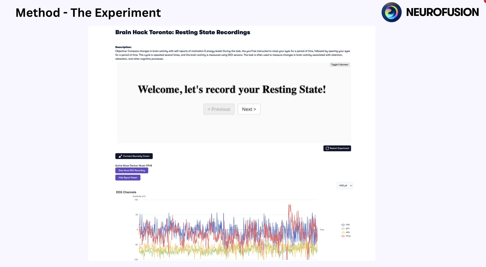
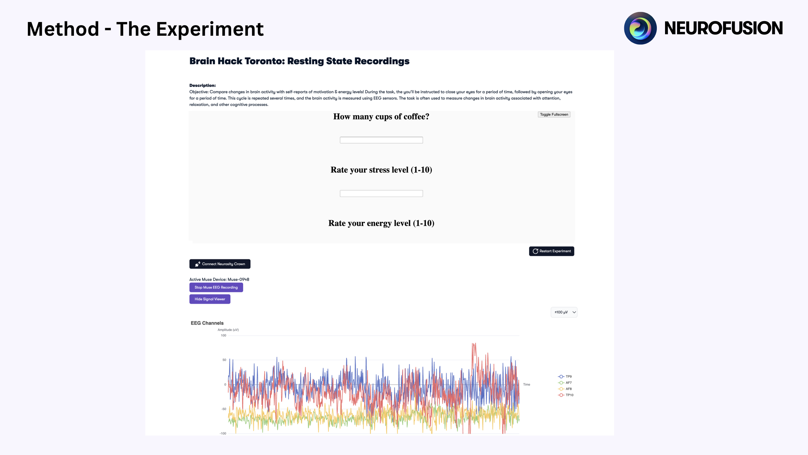
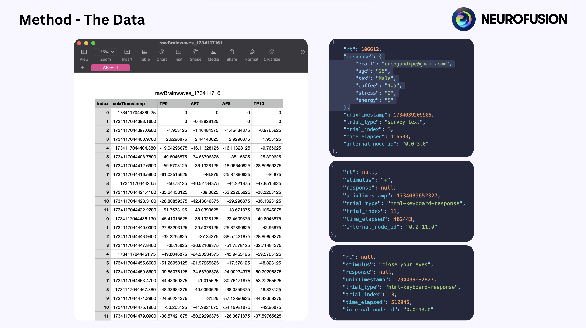
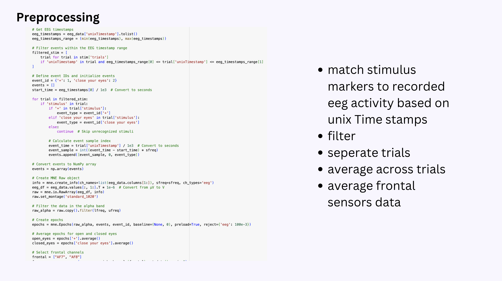
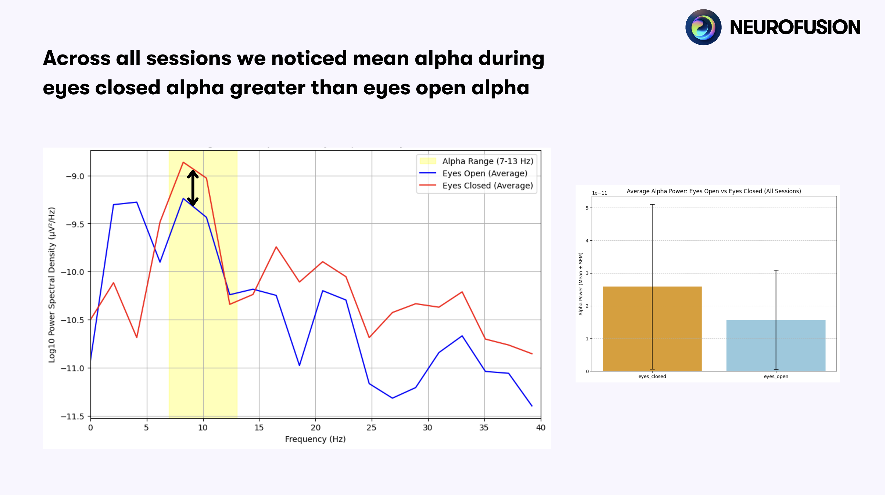

---
numbering:
  heading_2: false
  figure:
    template: Fig. %s
---

## Abstract
The year 2024 marks the centennial of Hans Berger's groundbreaking development of electroencephalography (EEG), a technology that revolutionized our understanding of brain activity. Over the past century, EEG has evolved from stationary laboratory equipment to portable, wearable devices that can capture neural signals in real-world settings. This transformation presents unprecedented opportunities for personalized neuroscience and mental health interventions.

Despite these technological advances, a significant challenge remains: collecting and analyzing longitudinal brain data that captures real-world neural dynamics across different contexts, states, and conditions. Traditional neuroscience research, typically conducted in controlled laboratory settings, often fails to capture the natural variations in brain activity that occur throughout daily life. This limitation has created a critical gap between our theoretical understanding of brain function and its practical application in personalized interventions.

In this paper, we present a novel approach to addressing this challenge through the NeuroFusion Explorer platform, which enables systematic collection and analysis of mobile EEG data in naturalistic settings. By focusing on diurnal variations in alpha-band activity, we demonstrate how this platform can be used to map neural correlates of stress and energy levels throughout the day. Our work establishes a framework for conducting longitudinal brain research that bridges the gap between laboratory insights and real-world applications, paving the way for more personalized and context-aware neurotechnology interventions.

## Methods

## Analysis

## Results

## Limitations & Next Steps
- More recordings!
- Removing confounding factors like environment noise.
- Removing the human in the loop during data preparation.
- Recording multiple sessions at the same time.
- More analysis between frequency bands.
- Understand how substance use affects neural correlates of stress and energy levels.